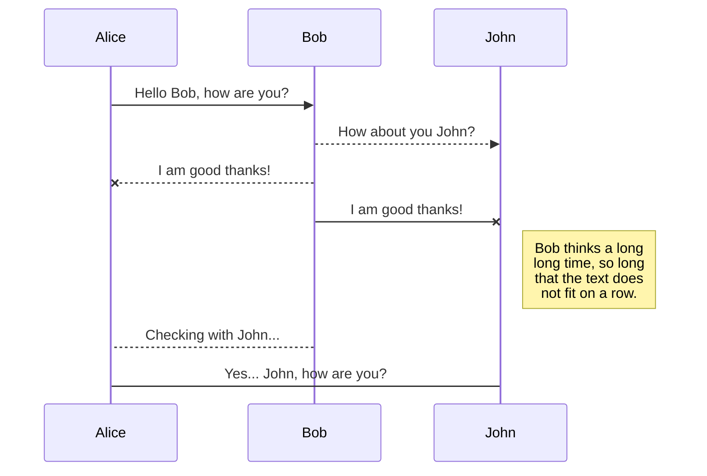
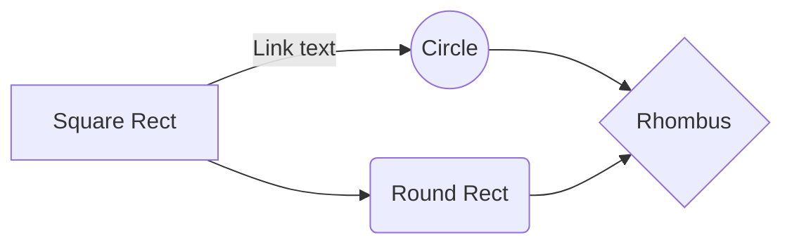


<p align="center">
  
</p>

<p align="center">
  Ce dépôt contient le code source d'une application Android au format 
  <strong><a href="https://en.wikipedia.org/wiki/Minimum_viable_product">Minimum Viable Product (MVP)</a></strong>
illustrant le patron de conception  <strong><a href="https://en.wikipedia.org/wiki/Model%E2%80%93view%E2%80%93presenter">Model View Presenter (MVP)</a></strong>.
</p>


Utilise Dagger2, RxJava2, Retrofit2, Room.

> Ceci n'est pas un starter kit.

<TABLE>
<tr>
    <td width=20% ></td>
    <td width=20% ></td>
    <td width=20% ></td>
    <td width=20% ></td>
    <td width=20% ></td>    
</tr>
</TABLE>

https://data.sncf.com/explore/dataset/liste-des-gares/information/

https://data.sncf.com/explore/dataset/liste-des-gares/api/


# Table des matières

  * [Pourquoi cette application](#Pourquoi-cette-application)
     * [Injection de dependance](#Injection-de-dependance)
     * [Qu est ce que l injection de dépendance](#Qu-est-ce que l injection de dépendance ?)
  * [Installation](#installation)
     * [Contributeurs](#Contributeurs)
     * [Pile Logicielle](#Pile-Logicielle)
  * [Getting Started](#Getting-Started)
     * [Installation](#Installation)
     * [Lancer les tests](#Lancer-les-tests)

Illustration  Modèle de Conception Android MVP

Ceci est un application démonstration du patron de conception logiciel  Model Vue Presenter


## Pourquoi cette application
Diffuser les bonnes pratiques. 

Capitaliser les connaissances. 

Faciliter l’apprentissage et la montée en compétence des développeurs/concepteurs. 

Homogénéisation de l’implémentation.


Pour définir et présenter l’architecture logicielle commune aux applications SPOT Mobiles et ainsi préparer la mise en place de composants technico fonctionnels communs et réutilisables. 

Modèle de conception 

Implémentation 
--> Schéma Directeur : Une pile logicielle unifiée 

Initialiser son projet Android 

Test unitaires 

Conventions de nommage 

Test 

Automatisation : Usine logicielle 

Intégration Continue 

Git dans l’usine Logicielle 

Build Android 

Configurer son projet pour la PIC 


 


#MVP #PackageByFeatures #Dagger2 #Retrofit #RxJava2 
----------

## Métriques
**//TODO**  à compléter
| Langage | Fichier| Code|
|--|--|--|
| JAVA | XX | 1664
| XML| XX | 999
| Total | XX | 666

## Pile Logicielle
//TODO à compléter

 - Retrofit2
 - Dagger2
 - RxJava2

## Outils de développement

//TODO à compléter
 - Stetho
 - 

# Maintenabilité

**Facilité de modification ou d'ajout d'une fonctionnalité.**

## Testabilité

**Très haute.** L'architecture MVP permet de tester unitairement le Presenter. De plus l'utilisation de Dagger2 améliore la flexibilité des tests d'intégration local et des tests UI. les composants peuvent être échangés très facilement et tester différents scénarios.


# Contributeurs
 - IDRISSI RIAHI Zakaria (Développeur)
 - FLAHAUW Benjamin (Développeur)
 - BRUGGEMAN Julien (Tech Leader)
 - DELAITRE Cyril (Product Owner)
 - VERMELLE Nathan (Tech Leader)

### Contributeur extérieur

 - Poulain Thomas
 
 
# Getting Started

Ces instructions vous permettront d'obtenir une copie du projet opérationnel sur votre machine locale à des fins d'apprentissage, de développement et de test. Voir déploiement pour les notes sur la façon de déployer le projet sur un système actif.
These instructions will get you a copy of the project up and running on your local machine for development and testing purposes. See deployment for notes on how to deploy the project on a live system.


### Installation

A step by step series of examples that tell you have to get a development env running

Say what the step will be

```
Give the example
```

And repeat

```
until finished
```

End with an example of getting some data out of the system or using it for a little demo


## Lancer les tests

Décrire comment lancer les tests

### Propos des tests

Décrire objectif des différents tests

## Sources

 -  [http://www.vogella.com/tutorials/Retrofit/article.html](http://www.vogella.com/tutorials/Retrofit/article.html)
 -  http://www.vogella.com/tutorials/RxJava/article.html

//TODO à compléter !


## UML diagrams - CECI EST UN EXEMPLE -

You can render UML diagrams using [Mermaid](https://mermaidjs.github.io/). For example, this will produce a sequence diagram:



And this will produce a flow chart:


