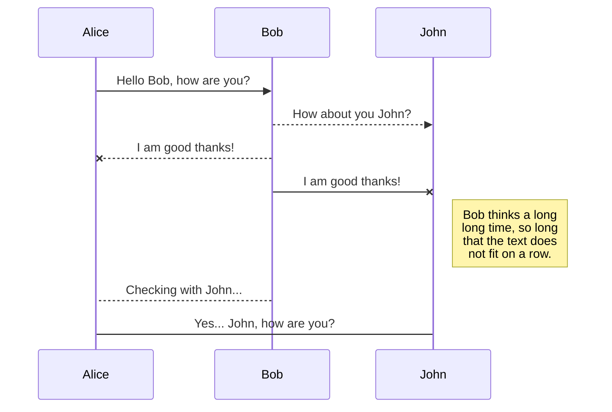
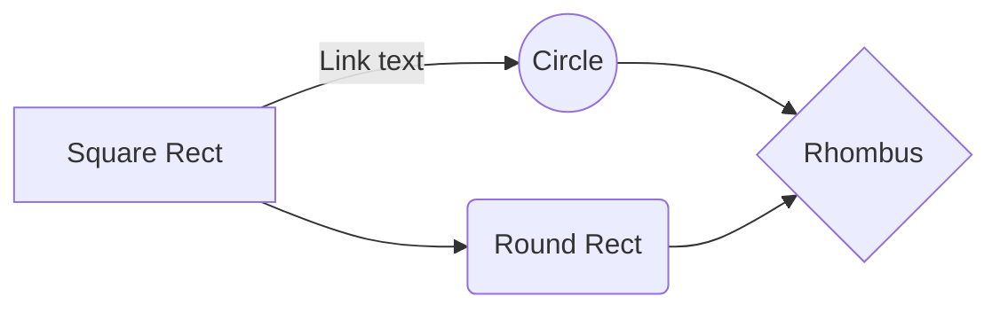

# Application Blanche 

#MVP #PackageByFeatures #Dagger2 #Retrofit #RxJava2 
----------
 Elle est basé sur le modèle  d'architecture logicelle en MVP et utilise Dagger2, RxJava2, Retrofit2, Room.

> Ceci n'est pas un starter kit.

# Métriques
**//TODO**  à compléter
| Langage | Fichier| Code|
|--|--|--|
| JAVA | XX | 1664
| XML| XX | 999
| Total | XX | 666

# Dépendances
//TODO à compléter

 - Retrofit2
 - Dagger2
 - RxJava2

## Outils de développement

//TODO à compléter
 - Stetho
 - 

# Maintenabilité

**Facilité de modification ou d'ajout d'une fonctionnalité.**

## Testabilité

**Très haute.** L'architecture MVP permet de tester unitairement le Presenter. De plus l'utilisation de Dagger2 améliore la flexibilité des tests d'intégration local et des tests UI. les composants peuvent être échangés très facilement et tester différents scénarios.

# Contributeurs
 - IDRISSI RIAHI Zakaria (Développeur)
 - FLAHAUW Benjamin (Développeur)
 - BRUGGEMAN Julien (Tech Leader)
 - DELAITRE Cyril (Product Owner)
 - VERMELLE Nathan (Tech Leader)

### Contributeur extérieur

 - Poulain Thomas

## Sources

 -  [http://www.vogella.com/tutorials/Retrofit/article.html](http://www.vogella.com/tutorials/Retrofit/article.html)
 -  http://www.vogella.com/tutorials/RxJava/article.html

//TODO à compléter !

## UML diagrams - CECI EST UN EXEMPLE -

You can render UML diagrams using [Mermaid](https://mermaidjs.github.io/). For example, this will produce a sequence diagram:

And this will produce a flow chart:

