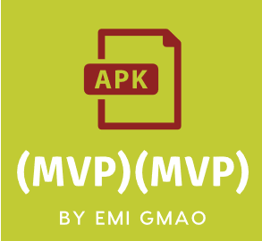
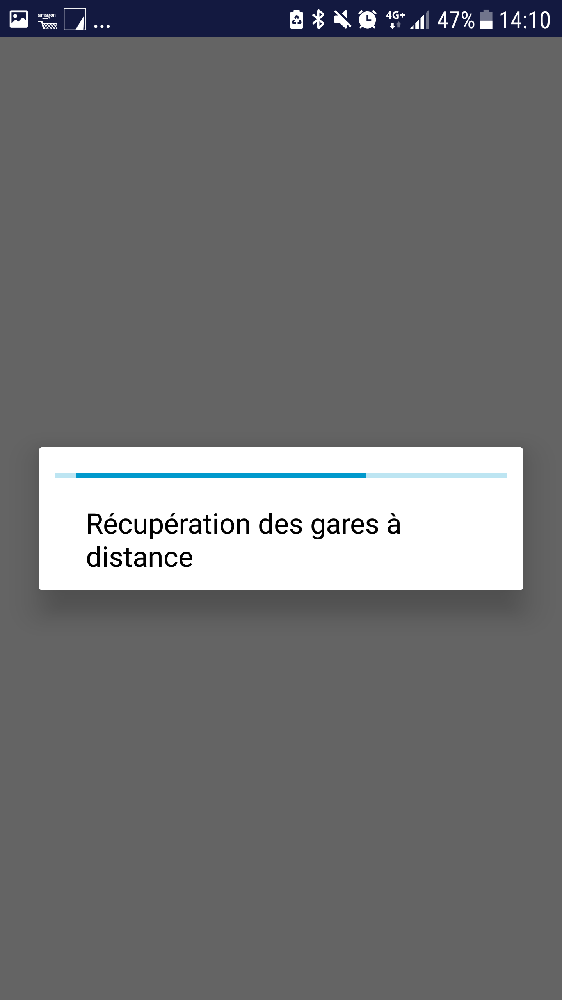
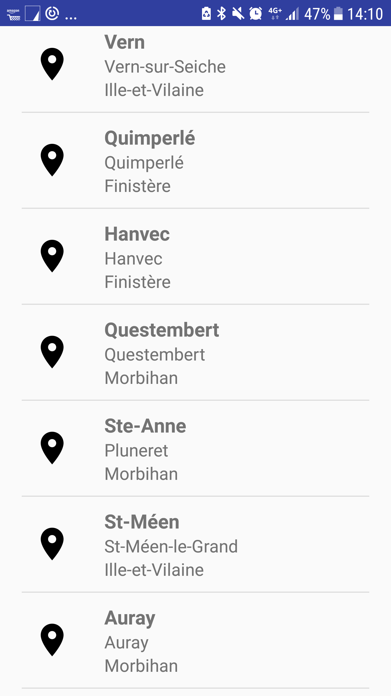
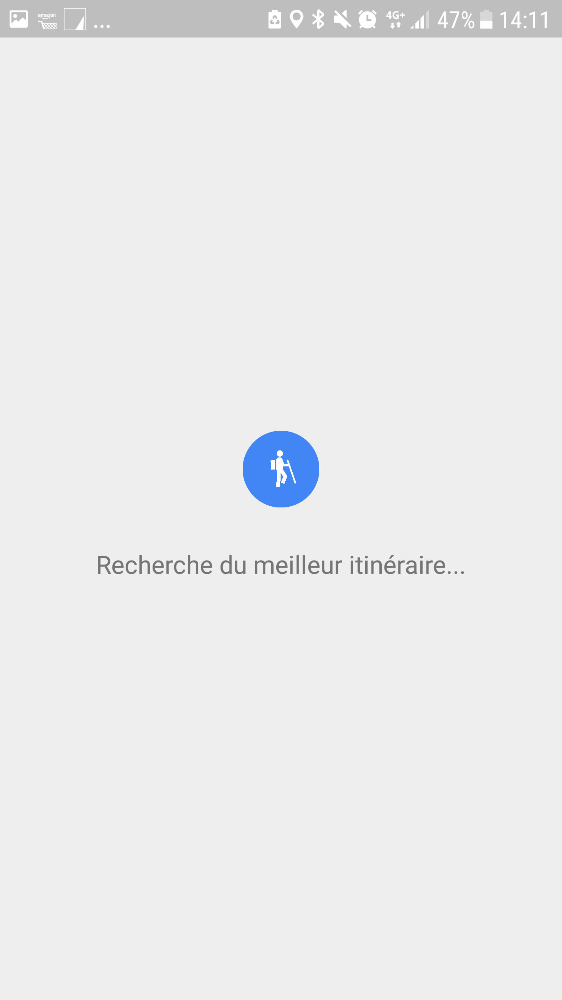
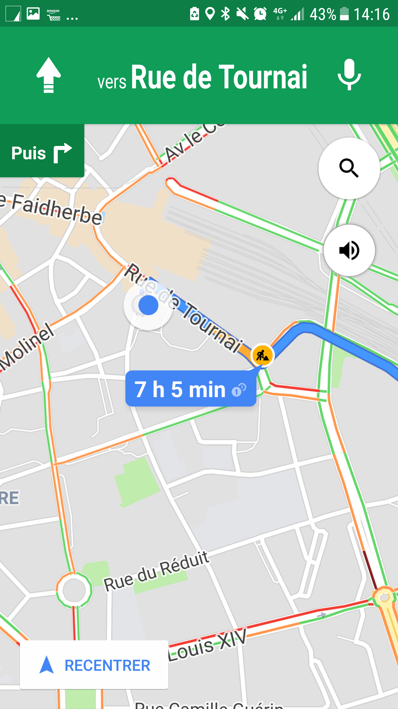
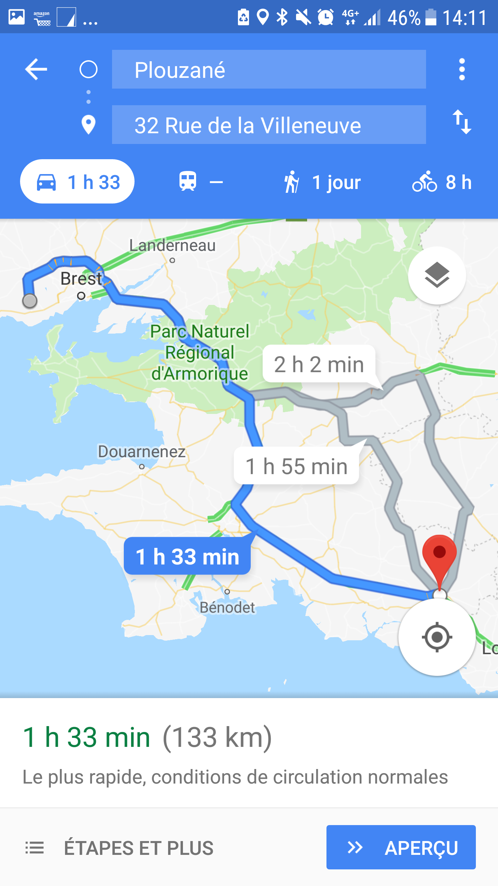
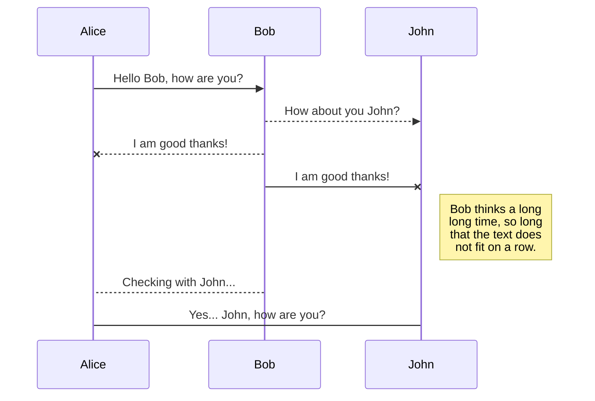
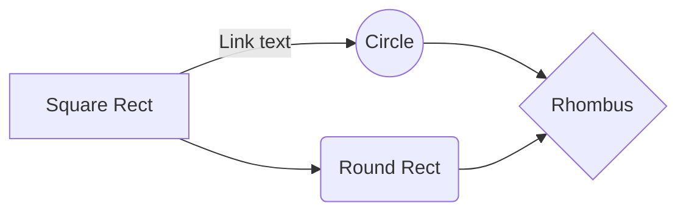

<p align="center">  
    
</p>  
  
<p align="center">  
  Ce dépôt contient le code source d'une application Android au format   
  <strong><a href="https://en.wikipedia.org/wiki/Minimum\_viable\_product">Minimum Viable Product (MVP)</a></strong>  
illustrant le patron de conception  <strong><a href="https://en.wikipedia.org/wiki/Model%E2%80%93view%E2%80%93presenter">Model View Presenter (MVP)</a></strong>.  
<br/><br/>
Utilise Dagger2, RxJava2, Retrofit2, Room
</p>  

<pre><code><strong>Pour</strong> les d&eacute;veloppeurs / concepteurs
<strong>Qui doivent</strong> r&eacute;aliser une application Android testable et maintenable
<strong>Ce d&eacute;pot gitlab propose </strong>une application fonctionnelle
<strong>Qui</strong> illustre les bonnes pratiques
</code></pre>

<TABLE>  
<tr>  
    <td width=20% ></td>  
    <td width=20% ></td>  
    <td width=20% ></td>  
    <td width=20% ></td>  
    <td width=20% ></td>      
</tr>  
</TABLE>  

Commencer par trouver le bon chemin pour se rendre à la gare, c'est la première étape pour prendre le train !
Notre application (mvp)(mvp) by EMI GMAO vous permet d'obtenir le meilleur itinéraire en un clic !
- La liste des gares et leurs positions GPS est obtenu via l'API OPEN DATA SNCF :
  https://data.sncf.com/explore/dataset/liste-des-gares/information/  
  https://data.sncf.com/explore/dataset/liste-des-gares/api
- L'itinéraire est ensuite établi grace à l'API Google Maps
----------
L'une des meilleures façons d'expérimenter un framework et des librairies en Android est de créer une application qui les utilise. 
C'est exactement ce que nous avons fait afin d'explorer le design pattern  [MPV](#https://en.wikipedia.org/wiki/Model%E2%80%93view%E2%80%93presenter) et les librairies appréciées par la communauté Android.  
Nous avons donc réalisé un exemple pratique d'une application "Clean Architecture" que nous partageons ici.`
  
> Ceci n'est pas un starter kit de développement.  
  

# Table des matières

  * [Pourquoi cette application](#h-Pourquoi-cette-application)
     * [Pourquoi le modèle MPV](#h-pourquoi-MVP)
		* [Qu’est-ce que le principe de « Séparation des préoccupations »  ?]{#h-quoi-SOC}	 
     * [Pourquoi avons-nous besoin de bien d’appliquer le principe de « Séparation des préoccupations » ? »  ?]{#h-pourquoi-SOC}	 
		* [Comment bien appliquer ce principe ?]{#h-comment-SOC}	 		
     * [Injection de dependance](#h-Injection-de-dependance)
     * [Qu est ce que l injection de dépendance](#Qu-est-ce que l injection de dépendance ?)
  * [Installation](#installation)
     * [Contributeurs](#Contributeurs)
     * [Pile Logicielle](#Pile-Logicielle)
  * [Getting Started](#Getting-Started)
     * [Installation](#Installation)
     * [Lancer les tests](#Lancer-les-tests)

Illustration  Modèle de Conception Android MVP

Ceci est un application démonstration du patron de conception logiciel  Model Vue Presenter


# Pourquoi cette application <a name="h-Pourquoi-cette-application">
  
- Diffuser les bonnes pratiques. 
- Capitaliser les connaissances. 
- Faciliter l’apprentissage et la montée en compétence des développeurs/concepteurs. 
- Homogénéisation de l’implémentation.
- Pour définir et présenter l’architecture logicielle commune aux applications SPOT Mobiles et ainsi préparer la mise en place de composants technico fonctionnels communs et réutilisables. 
- Conception:
	- Modèle de conception 

- Implémentation 
	- --> Schéma Directeur : Une pile logicielle unifiée 
Initialiser son projet Android 

Test unitaires 
Conventions de nommage 
- Test 
Automatisation : Usine logicielle 
Intégration Continue 
Git dans l’usine Logicielle 
Build Android 
Configurer son projet pour la PIC 

## Pourquoi le modèle MPV  <a name="h-pourquoi-MVP">
Parce que l'on se préocupe de respecter le principe de Séparation des préoccupations

### Qu’est-ce que le principe de « Séparation des préoccupations »  ? <a name="h-quoi-SOC">

« La séparation des préoccupations (separation of concerns) est un principe de conception visant à séparer un programme informatique en parties, afin que chacune d’entre elle isole un problème précis de la problématique générale.
https://fr.wikipedia.org/wiki/S%C3%A9paration_des_pr%C3%A9occupations
Une préoccupation (concern) est un ensemble d’informations qui affecte le code d’un programme informatique. Le concept de préoccupation peut recouvrir des aspects informatiques très variés.

Un programme qui intègre les principes de séparation des préoccupations est appelé un programme modulaire, car il sépare son code en différent modules. 
La modularité, et donc la séparation des préoccupations, est obtenue en encapsulant des informations dans une section de code qui a une interface bien définie. 
L’encapsulation du code dans des modules amène un masquage de l’information.
Les conceptions en couches dans les systèmes d’information constituent un autre mode de réalisation de la séparation des préoccupations (par exemple, couche de présentation, couche logique métier, couche d’accès aux données, couche de persistance.)

L’application du principe de séparation des préoccupations simplifie le développement et la maintenance des programmes informatiques. Quand les préoccupations sont strictement séparées, les différentes parties du code peuvent être réutilisées, étendues ou modifiées indépendamment des autres. Cela permet ainsi d’intervenir sur une partie du code sans avoir de connaissance particulière sur l’ensemble des autres parties. »
Définition Wikipédia

### Pourquoi avons-nous besoin de bien d’appliquer le principe de « Séparation des préoccupations » ?  <a name="h-pourquoi-SOC">

Premièrement, nous devons affronter la complexité interne autant que de l’incertitude de l’environnement.
Ce principe de séparation permet de rendre les différentes couches (données, contrôleur, vue) indépendantes.

Un des atouts principal de séparer les préoccupations est que le code spécifique à Android se trouve que dans la vue. 
Le controleur est composé que de JAVA. Ce qui peut permettre par exemple l’intégration de développeur +/- expérimenté sur la technologie android à des projet Android.


### Comment bien appliquer ce principe ?  <a name="h-comment-SOC">

L’approche des meilleures pratiques pour organiser les applications Android en composants logiques a évolué au cours des dernières années. 
La communauté s’est éloignée du modèle monolithique Modèle Vue Contrôleur (MVC) en faveur de modèle plus modulaires et testables. 

Les deux alternatives les plus largement adoptées sont :
-	le Modèle Vue Presenteur (MVP)
-	le Modèle Vue Vue Modèle (MVVM)

Au démarrage de la présente étude il y a eu un consensus pour adopter le modèle MVP. Le principal argument étant que le MVP est plus facile à appréhender, à modifier et à enrichir. L’ajout de nouvelles fonctionnalités avec MVVM nécessite plus d’expérience et d’expertise.

Avantage du modèle MVP :
	
-	Le pattern d’architecture MVP est conçu pour faciliter  le respect du principe de séparation des préoccupations ::
	Le Modèle traite des données. 
	La Vue permet d'afficher des données et de réagir aux entrées de l'utilisateur.
	Le Presenteur permet au Modèle et à la Vue de communiquer entre eux.
Cette modularisation des composants facilite considérablement la maintenance et l’évolution du code.

-	MVP rend le code plus testable : 
Lorsqu'il est implémenté correctement, seule la Vue de l’application contient des API spécifiques à la structure Android - en général, la Vue est implémentée en tant qu'Activity, Fragment et la Vue est une vue passive qui ne contient pas ou très peu de logique.

-	MVP encourage l’architecture modulaire :
Le Presenteur ne connaît la Vue qu'à travers une interface et, par conséquent, on peut facilement échanger l'implémentation de Vue tant que la nouvelle Vue est conforme à l'interface. 
Dans l'ensemble, la conception MVP encourage l’architecture propre.
Le composant ne contient que du code JAVA (pas de développement spécifique Android) ce qui permet de le tester plus facilement. 

Avant de nous lancer directement dans l’application de ce modèle, qu’en est-il des nouveaux outils disponibles pour les développeurs Android ? Il existe maintenant de nombreuses bibliothèques Android qui leur facilitent la vie et permettent de dynamiser l’obtention d’architectures correctes partagées : c’est l’objet de cette étude.

## Injection de dépendance
### Qu'est-ce que l'injection de dépendance ?

L'injection de dépendances est un mécanisme qui permet d'implémenter le principe de l'inversion de contrôle.
Il consiste à créer dynamiquement (injecter) les dépendances entre les différents objets en s'appuyant sur une description (fichier de configuration ou métadonnées) ou de manière programmatique. Ainsi les dépendances entre composants logiciels ne sont plus exprimées dans le code de manière statique mais déterminées dynamiquement à l'exécution.

### Pourquoi avons-nous besoin de l'injection de dépendance ?

Si une classe java crée une instance d'une autre classe via l'opérateur new, alors elle ne peut pas être utilisée et testée indépendamment de cette classe → dépendance forte.

Il semble très difficile, voire impossible, d’effectuer des tests unitaires sous Android. Trop souvent sont remis en cause les Activités, Fragments et Vues, qui possèdent leurs propre cycles de vies et qui utilisent des méthodes propres au système, et dépendantes d’un Context.

L'avantage le plus important de fournir les dépendances de l'extérieur de la classe est qu'il augmente la possibilité de réutiliser celle-ci et de pouvoir la tester indépendamment des autres classes.

### Comment faire de l’injection de dépendance ?

C'est un des objets de cette application.

#MVP #PackageByFeatures #Dagger2 #Retrofit #RxJava2 
----------

## Métriques
**//TODO**  à compléter
| Langage | Fichier| Code|
|--|--|--|
| JAVA | XX | 1664
| XML| XX | 999
| Total | XX | 666

## Pile Logicielle
//TODO à compléter

 - Retrofit2
 - Dagger2
 - RxJava2

## Outils de développement

//TODO à compléter
 - Stetho
 - 

# Maintenabilité

**Facilité de modification ou d'ajout d'une fonctionnalité.**

## Testabilité

**Très haute.** L'architecture MVP permet de tester unitairement le Presenter. De plus l'utilisation de Dagger2 améliore la flexibilité des tests d'intégration local et des tests UI. les composants peuvent être échangés très facilement et tester différents scénarios.


# Contributeurs
 - IDRISSI RIAHI Zakaria (Développeur)
 - FLAHAUW Benjamin (Développeur)
 - BRUGGEMAN Julien (Tech Leader)
 - DELAITRE Cyril (Product Owner)
 - VERMELLE Nathan (Tech Leader)

### Contributeur extérieur

 - Poulain Thomas
 
 
# Getting Started

Ces instructions vous permettront d'obtenir une copie du projet opérationnel sur votre machine locale à des fins d'apprentissage, de développement et de test. Voir déploiement pour les notes sur la façon de déployer le projet sur un système actif.
These instructions will get you a copy of the project up and running on your local machine for development and testing purposes. See deployment for notes on how to deploy the project on a live system.


### Installation

A step by step series of examples that tell you have to get a development env running

Say what the step will be

```
Give the example
```

And repeat

```
until finished
```

End with an example of getting some data out of the system or using it for a little demo


## Lancer les tests

Décrire comment lancer les tests

### Propos des tests

Décrire objectif des différents tests

## Sources

 -  [http://www.vogella.com/tutorials/Retrofit/article.html](http://www.vogella.com/tutorials/Retrofit/article.html)
 -  http://www.vogella.com/tutorials/RxJava/article.html

//TODO à compléter !


## UML diagrams - CECI EST UN EXEMPLE -

You can render UML diagrams using [Mermaid](https://mermaidjs.github.io/). For example, this will produce a sequence diagram:



And this will produce a flow chart:


